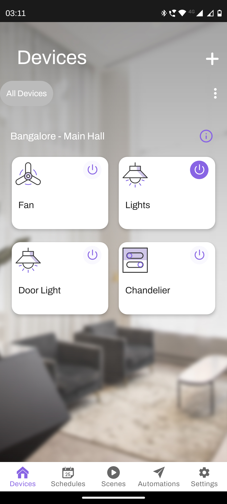
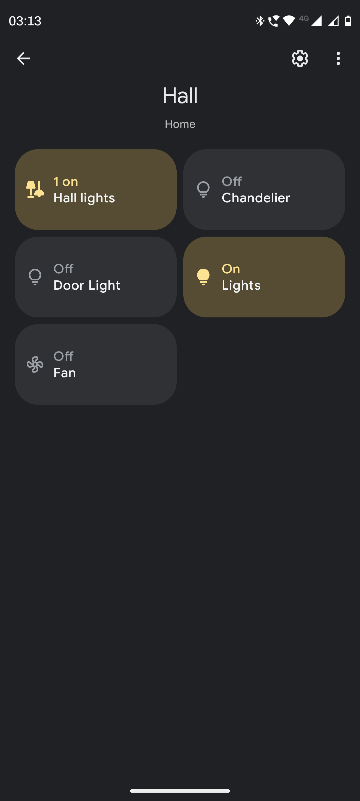
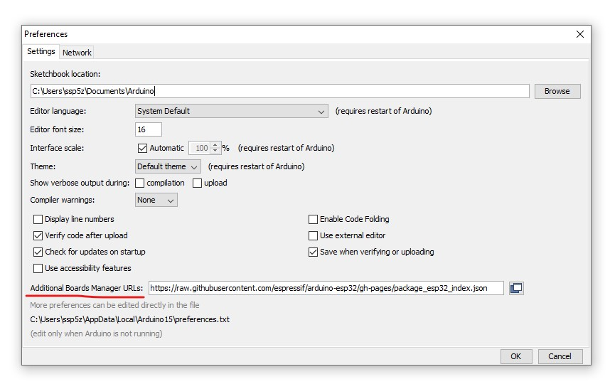
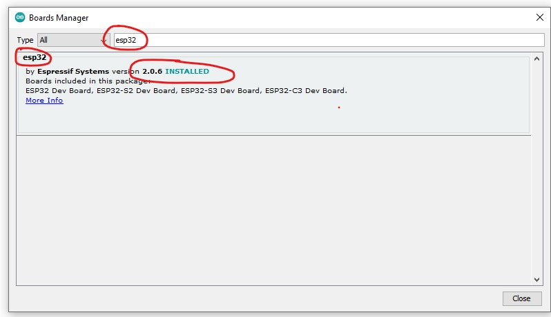

# ESP32 - Home Automation with Rain Maker (Arduino IDE)

A custom addon that can be added on any existing Switch Board in your house to make it Automated.

 

## Total Cost

including the normalized shipping and custom charges.

### Dishonesty Disclaimer

The above mentioned cost is completely dishonest and excludes the following factors:

* **Bulk Orders** - The shipping cost was less because of the bulk order.
* **Defective and Missing Pieces** - Some boards did not work, some relays never trigger.
* **Time** - The time spent trying to figure out why the hell GPIO13 and internal LED are not working in the chinese version. _(I finally gave up!)_
* **Mental Health** - The mental health of the person who made this project.
* **Mental Health of the person who will read this** - The mental health of the person who will read this project.

## Demo

| Rain Maker App                         | Google Home                             |
|----------------------------------------|-----------------------------------------|
|  |   |

## Motivation

1. Make a home automation within a budget < $5 USD. Why?? That's a good question.
2. Make the example code more humanly readable, configuarable and reusable.

## Requirement

### Hardware

1. **ESP32** - Any ESP32 Board - ([1.25 USD](https://www.alibaba.com/product-detail/ESP32-Development-Board-Wireless-WiFi-Dual_1600280591052.html))
2. 5V/3.3V **Relay(s)** or a Relay Breakout Board - ([1.10 USD](https://www.alibaba.com/product-detail/4-channel-relay-expansion-board-module_1600668519557.html?spm=a2700.galleryofferlist.normal_offer.d_title.45e31340EXHKfa))
3. Old Cell Phone charger _(free)_
4. Old USB Type B Cable _(free)_
5. Some Jumper Cables _(free)_

* **Note:** The ESP32 purchase links are just for reference. These do not register as known Chips by Arduino IDE, ExpressIf or ESP Dashboard. If you are a hobbyist, I highly recommend you spend a couple of bucks more and buy an authorized ESP32 breakout/dev board from a local store.

### Software

All the software required to run this project are free and open source.

1. **Arduino IDE** - [Download](https://www.arduino.cc/en/Main/Software)
2. **Espressif Board Manager** - [Link](https://raw.githubusercontent.com/espressif/arduino-esp32/gh-pages/package_esp32_index.json)
3. **Rain Maker Mobile App** - [Play Store](https://play.google.com/store/apps/details?id=com.rainmakerlabs.rainmaker) | [App Store](https://apps.apple.com/us/app/rainmaker/id1455001459)

## Usage

1. Download the Arduino IDE and install it.
2. Open File > Preferences and add the above EspressIf Board Manager URL to the Additional Boards Manager URLs field.

3. Open Tools > Board > Boards Manager and verify if `esp32` is listed. _(Restart the IDE if needed)_

4. Clone this repository and open the folder in the Arduino IDE.
5. Change the PIN configurations according to your setup.
6. Connect the ESP32 to your PC using a USB Type B Cable.
7. Select the correct Board and Port in the Tools menu. _(Tools > Board > ESP32 Dev Module)_
8. Ensure to use the partition scheme `RainMaker` in the Tools menu. _(Tools > Partition Scheme > RainMaker)_
9. Upload the code to the ESP32.
10. Open the Serial Monitor and click on the last link to open the QR code in the browser.
11. Download the Rain Maker Mobile App and Scan the QR code.
12. Enjoy!
